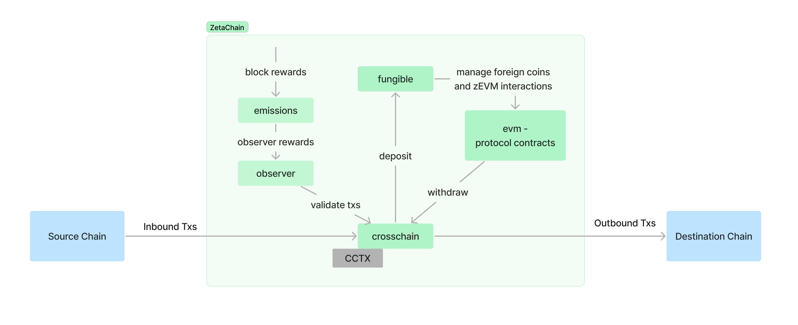

## SDK modules

### `crosschain`

The `crosschain` module tracks the state of cross-chain transactions (CCTX). A CCTX is created when a source chain (external chain or ZetaChain) interacts with a destination chain (another external chain or ZetaChain if the source chain is not ZetaChain) through ZetaChain.

A CCTX objects contains the state of the transactions on external chains. There are two types of external transactions:

- Inbound Tx: a transaction initiated in a external chain to be observed in ZetaChain to create a new CCTX
- Outbound Tx: a transaction broadcasted to a external chain as a result of a CCTX creation

An inbound tx is initiated in the source chain. An outbound tx can be broadcasted in the destination chain for the processing of the CCTX or in the source chain in the case where a CCTX is being reverted.

The CCTX also holds a status that can contain the following values:

- `PendingInbound`: observation of an inbound tx has been initiated but not voted yet
- `PendingOutbound`: an outbound tx has been broadcasted but not observed yet
- `OutboundMined`: the outbound tx has been observed, this is the final state of a successful CCTX
- `PendingRevert`: an outbound tx for revert has been broadcasted but not observed yet
- `Reverted`: the outbound tx for revert has been observed, this is the final state of a unsuccessful CCTX
- `Aborted`: something went wrong and a revert tx can’t be processed or create

### `fungible`

The `fungible` module facilitates the deployment of fungible tokens of connected blockchains (called "foreign coins") on ZetaChain.

Foreign coins are represented as ZRC20 tokens on ZetaChain.

When a foreign coin is deployed on ZetaChain, a ZRC20 contract is deployed, a pool is created, liquidity is added to the pool, and the foreign coin is added to the list of foreign coins in the module's state. This is a manual process trigger by an admin group. 

The module contains the logic for:

- Deploying a foreign coin on ZetaChain
- Deploying a system contract, Uniswap and wrapped ZETA
- Depositing to and calling omnichain smart contracts on ZetaChain from connected chains (`DepositZRC20AndCallContract` and `DepositZRC20`)

`fungible` module represents in general the high-level logic of cross-chain transactions for interactions with ZetaChain while `crosschain` module represents low level logic.

### `observer`

The `observer` module keeps track of ballots for voting, the observer accounts, a list of supported connected chains, core parameters (contract addresses, outbound transaction schedule interval, etc.), observer parameters (ballot threshold, min observer delegation, etc.), and admin policy parameters.

This is the module that validates the integrity of data from external chains for the `crosschain` module.

Ballots are used to vote on inbound and outbound transaction. The `observer` module keeps create, read, update, and delete (CRUD) operations for ballots, as well as helper functions to determine if a ballot has been finalized. The ballot system is used by other modules, such as the `crosschain` module when observer validators vote on transactions.

An observer validator is a validator that runs `zetaclient` alongside the `zetacored` (the blockchain node) and is authorized to vote on inbound and outbound cross-chain transactions.

### `emissions`

The `emissions` module is responsible for orchestrating rewards distribution for observers, validators and TSS signers. Currently, it distributes rewards to validators and observers every block. TSS reward distribution is not implemented. The undistributed amount for TSS is stored in its respective pool.

### Protocol contracts

Most of the logic for cross-chain functionalities is defined in the Cosmos modules described above but some of the functionalities are defined in contracts deployed in the zEVM, this includes:

- ZRC20 tokens for foreign coins
- Wrapped ZETA token
- System contract to interact with the zEVM through cross-chain txs
- Uniswap V2 pools to enable token swap

### Diagram

